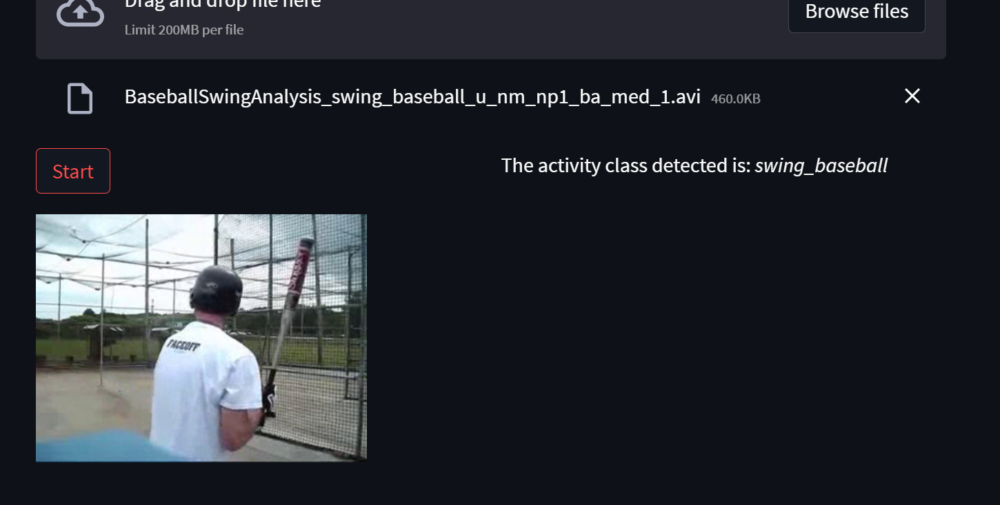

# Movement analisys with Pytorch

These is an example of how can be implemented a video analyser in pytorch capable of detecting the kind of movement made.

It has been implemented using the dataset HMDB51 from
https://serre-lab.clps.brown.edu/resource/hmdb-a-large-human-motion-database/ 

The 51 clases have been simplified to six in order to make the task less time consuming with training.

- Climbing
- Dribbling
- Golf
- Bike Riding
- Bow Shooting
- Baseball

## Approach

The appoach has been segmented in four parts: 
1. Data preparation
2. Model training
3. Inference Testing and simple user interface

## How to install this.

1. Download from github.
2. Install all the videos included in the sis above referred classes in the data_red(uced) folder.
3. In the python environment you are using install the file:
	- requirements.txt via `pip install -r requirements.txt`
	if you are not goign to use the user interface, or the file: 
	- requirements.txt via `pip install -r requirements_st.txt`
	if you use the streamlit interface.

## Files and description

There are xx major files:

- preprocessing.py
- data_preparation.py
- model_training.py and model.py
- inference.py
- st_app.py

#### preprocessing.py

In this file you will find all the activities needed to make extract the frames of the videos needed. We are using the r3d_18 model taht is possible to get from the *torchvision* library. We will have to use a model that not only analyses the frames supplied but also the order of the frames supplied, and therefore in this file are the tools needed to generate a sequence of frames from every training supplied video.

#### data_preparation.py

Here is where the frames obtained before will be separated in the train and test groups. The Datasets with his correspondients transforms are defined. And where the Dataloaders that are going to be used in training are defined.

#### model_training.py and model.py

Not much to explain here, the model is trained and the best result is saved to be able to deploy it afterwards. Due to their size the weights are not stored in GitHub. They can be found [here](https://drive.google.com/file/d/1K1hZav2uy99HcFfC9yae-ciWX9o6rPb5/view?usp=sharing)
	In the *model.py* is defined the model (r3d_18) 

#### inference.py

In this file the inference function is defined with the bes state saved in the model training phase. A function is defined that with the input of an avi file is possible to return the classification of the motion activity.

#### st_app.py

Just a very simple user interface where is possible to load some video, and this video will be sliced in frames, loaded in the model and the classification will be issued. To use this user interface remember to use `stramlit run st_app.py` from your virtual environment.

### Results

After 80 epochs the model has been reported to have an accuracy of 98% 

